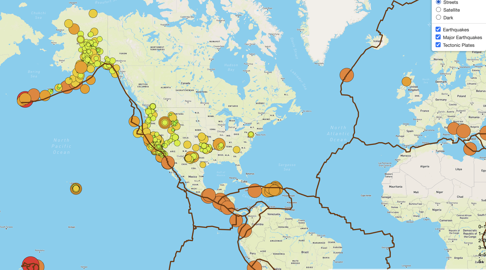
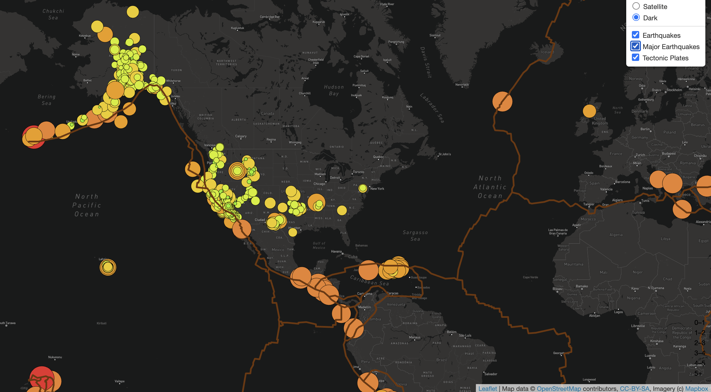

# Mapping_Earthquakes

## Purpose

The objective of this project is to gather earthquake GeoJSON data from the USGS API, create and explore interactive maps of earthquakes around the world.
The earthquake data is represented on the maps in relation to the tectonic plates’ location on the earth, and according to each event's magnitude.

## Resources
Data Source: Earthquakes GeoJSON, Earthquakes above 4.5mag GeoJSON, Tectonic Plate GeoJSON
Software: HTML/CSS, JavaScript, Visual Studio Code 1.49.1, Leaflet 1.7.1, D3.js 6.2.0

## Tasks
To complete this project, use a URL for GeoJSON earthquake data from the USGS website and retrieve geographical coordinates and the magnitudes of earthquakes for the last seven days. Then add the data to a map.

## Approach
Your approach will be to use the JavaScript and the D3.js library to retrieve the coordinates and magnitudes of the earthquakes from the GeoJSON data. You'll use the Leaflet library to plot the data on a Mapbox map through an API request and create interactivity for the earthquake data.

## Results 

